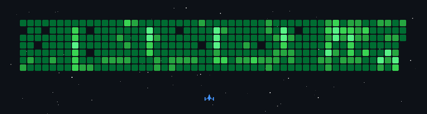

## Hi there👋

I'm a Computer Science and Mathematics (Statistics) student in Sydney, interested in backend systems, databases, and software that stays correct under concurrency and failure.

My projects cover backend development, database systems, real-time applications, and automation, with an emphasis on concurrency, data consistency, API integration, testing, and observability.

I’m currently expanding into full-stack development to build complete applications, from backend services to user interfaces.

## Projects

  

## GitHub Activity

  
  

  

